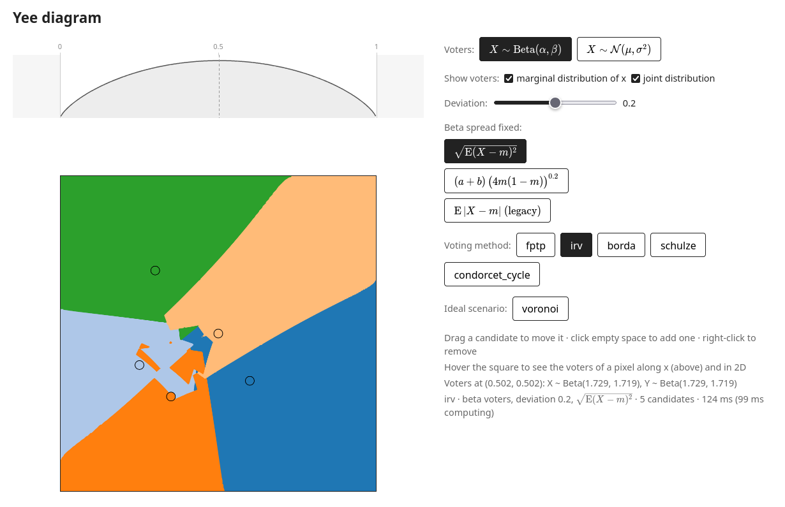

# YeeLab

A Yee diagram compares voting methods. Candidates are fixed points $c_1, \dots, c_C$ in the unit square $[0,1]^2$. The square is split into $n \times n$ pixels, and every pixel is its own election:

- the voters of the pixel are spread around the pixel centre $m$,
- every voter ranks the candidates by distance (closest first),
- the pixel is coloured by the winner of that election.



## What is different here

In the original Yee diagram the voters of a pixel are normal, $\mathcal{N}(m, \sigma^2 I)$, so some of them end up outside the square. Here each coordinate is Beta distributed instead, so every voter stays inside the square:

$$X \sim \text{Beta}(a, b), \qquad Y \sim \text{Beta}(a', b'), \qquad X, Y \text{ independent.}$$

$(a, b)$ are chosen per pixel so that

1. the pixel centre is the **median**: $F(m; a, b) = \tfrac12$,
2. the spread is the same for every pixel: $\sqrt{\mathbb{E}(X - m)^2}$ equals its value at the centre pixel, where $\mathbb{E}|X - \tfrac12| = D$.

$D$ is the `--deviation` of the plots and the *Deviation* slider of the UI (default $0.2$).

Why it matters: with normal voters every Condorcet method draws exactly the Voronoi diagram of the candidates. With Beta voters the median is a median only along the axes, so the skew of the distribution decides diagonal head-to-head races. Condorcet regions get pulled towards the centre and Condorcet cycles appear.

Voting methods: FPTP, IRV, Borda, Schulze, and `condorcet`, which marks pixels without a Condorcet winner in black. Baldwin, Nanson, Minimax, Black (the Condorcet winner, otherwise Borda) and approval voting are in the web UI only, where every method is [built from blocks](#methods-from-blocks). How the ranking probabilities are computed (exactly, without sampling voters) is described in [docs/math.pdf](docs/math.pdf).

## Running it

Requires [uv](https://docs.astral.sh/uv/).

### Plots

[yeelab/pixels/plot.py](src/yeelab/pixels/plot.py) saves one PNG per method into `src/yeelab/pixels/plots/`:

```sh
uv run python -m yeelab.pixels.plot                         # all methods, Beta voters
uv run python -m yeelab.pixels.plot -m irv -m schulze       # only some methods
uv run python -m yeelab.pixels.plot --distribution normal   # original Yee model
uv run python -m yeelab.pixels.plot -d 0.3 -p 800           # deviation 0.3, 800x800 pixels
uv run python -m yeelab.pixels.plot -h                      # all options
```

Ranking probabilities are cached in `src/yeelab/pixels/cache/`, so a second run with the same settings is fast (`--regenerate` ignores the cache). Candidates are set in [yeelab/pixels/plot.py](src/yeelab/pixels/plot.py).

### Web UI

```sh
uv run fastapi dev
```

Then open http://127.0.0.1:8000. [yeelab/web/app.py](src/yeelab/web/app.py) serves the page in [yeelab/web/ui/index.html](src/yeelab/web/ui/index.html) and computes the diagrams. The diagram is drawn as curves, not pixels: the backend returns the region of every winner as polygons (`POST /api/regions`). It computes only the shares the method needs, caches everything a drag does not change, runs the hot loops as compiled [numba](https://numba.pydata.org/) kernels, and traces each border as the zero set of the winner's margin. The details are in the last chapter of [docs/math.pdf](docs/math.pdf). The very first start compiles the kernels, which takes a few seconds; numba caches them afterwards.

- **Candidates:** drag one to move it, click empty space to add one (up to 8), right-click to remove one. The diagram follows the drag, typically within 5–40 ms; IRV with 8 candidates, which needs every ranking cell, within about 0.1–0.2 s.
- **Method:** Voronoi (no voters, the reference), FPTP, IRV, Borda, Baldwin, Nanson, Schulze, Condorcet, Minimax, Black, Score (range), Score (avg) or Score (D'Hondt). The tooltip of a method says what it does and which blocks it is built from.
- **Voters:** Beta, or normal for the original Yee model.
- **Deviation:** $D$ from $0.05$ to $0.4$.
- **Hover** over the square to see the voters of that pixel: their 2D density over the square and their distribution along $x$ above it.

Or in Docker, without uv:

```sh
docker build -t yee-lab .
docker run -p 8000:8000 yee-lab
```

## Code

The code is the package `yeelab` in [src/yeelab/](src/yeelab/). It computes a diagram in two ways, which never import each other:

- `yeelab/margin/` — the web UI's way: only the shares each method needs, a winner with a margin that is 0 on every border, and the regions as polygons traced along that zero set. Its methods are built from blocks in `yeelab/build/` (below).
- `yeelab/pixels/` — the original way: the complete ranking profile of every pixel, cached on disk, the winner of every pixel, and the plot CLI. [docs/figures.py](docs/figures.py) and the tests use it, the tests as the reference for `margin/` and `build/`.

`pixels/methods.py` has the methods on the complete profile. The web UI's are in `build/`. What `margin/` and `pixels/` both use is at the top of the package: the voter models and ranking cells (`ranking_cells.py`, `normal.py`), `voting.py` (the IRV rounds and the Condorcet-cycle code) and `threads.py`. `yeelab/web/` is the FastAPI app and the page, on top of `margin/`.

`uv run pytest` runs the tests (GitHub Actions runs them on every push and pull request, and builds the Docker image); `uv run python docs/figures.py` regenerates the figures of [docs/math.pdf](docs/math.pdf).

### Methods from blocks

[yeelab/build/](src/yeelab/build/) puts a voting method together from small blocks, like Scratch does, but with plain Python constructors:

```python
from yeelab.build import Tally, BordaCount, Plurality, Highest, Eliminate
from yeelab.build import Pairwise, Margins, StrongestPaths, Weakest, Unbeaten, Fallback

borda   = Highest(Tally(BordaCount()))
fptp    = Highest(Tally(Plurality()))
irv     = Eliminate(Tally(Plurality()), how="min")
baldwin = Eliminate(Tally(BordaCount()), how="min")
nanson  = Eliminate(Tally(BordaCount()), how="mean")

margins = Margins(Pairwise())
schulze = Unbeaten(StrongestPaths(margins))
condorcet = Unbeaten(margins)
minimax = Highest(Weakest(margins))
black   = Fallback(condorcet, borda)

from yeelab.build import Score, ScoreAvg, ScoreDH

score_range = Highest(Tally(Score(6)))   # scores 0 to 5 in proportion to the distance
score_avg   = Highest(Tally(ScoreAvg(6)))   # ... with the mean distance in the middle
score_dh    = Highest(Tally(ScoreDH(6)))    # ... the steps shared out among the gaps
```

A **ballot** (`Plurality`, `BordaCount`) gives a candidate points by their position among the remaining candidates, `Tally` averages those points over the voters of a pixel into **totals**, and a **winner** block decides: `Highest` takes the highest total, and `Eliminate` drops the lowest total (`how="min"`) or every total at most the mean (`how="mean"`) round by round until one candidate is left. The Condorcet methods start from `Pairwise()` (who ranks one candidate above another): `Margins` and `StrongestPaths` give **diffs** (how strongly one candidate beats another), `Weakest` gives a candidate its weakest diff as its total, `Unbeaten` elects the candidate no one beats (none in a Condorcet cycle), and `Fallback(first, second)` uses `second` where `first` elects no one. A **score ballot** gives every candidate a score from 0 to `levels - 1`, the top score to the closest candidate and 0 to the farthest; the others' scores depend on how far the candidates are and not only on their order. `Score` gives them the score in proportion to where their distance is between the closest and the farthest, `ScoreAvg` likewise with the mean distance to all candidates in the middle of the scale, and `ScoreDH` shares the steps between the scores out among the gaps between neighbours in the order of distance (`delta` sets how much the large gaps are favoured; 1 is D'Hondt). With two levels they are approval ballots: `ScoreDH(2)` approves the candidates above the largest gap, and `ScoreAvg(2)` those closer than the mean distance, the best ballot of a voter who knows nothing of how the others vote. The voters who give a candidate a score have curved borders, so their share is summed over a fine grid of voters instead of polygons; it is within about $10^{-3}$ of the exact share ([docs/math.pdf](docs/math.pdf), section 3.7). A block checks its input when it is built (`Highest(BordaCount())` raises `TypeError: Highest expects CandidateTotals, got a Ballot`), and `repr` gives back the expression.

Each method computes only the shares it needs (`method.needs`): first choices for FPTP, pairwise shares for all the others but IRV (the Borda score of $c$ among the remaining candidates $S$ is $\sum_{e \in S} d_{ce}$, with $d_{ce}$ the share ranking $c$ above $e$), the whole profile for IRV, which runs on the compiled rounds of `voting.py`, and the score shares of its ballot for a score method. Every block that decides also computes its own gap, and the margin is the smallest of them, so the borders of a built method are traced like any other. `method.evaluate(voters)` returns the winner and the margin; `margin/regions.py` draws the methods of `yeelab.build.METHODS`.

## License

[MIT](LICENSE). The bundled [KaTeX](src/yeelab/web/ui/vendor/katex/LICENSE) and [uPlot](src/yeelab/web/ui/vendor/uplot/LICENSE) are MIT too.
